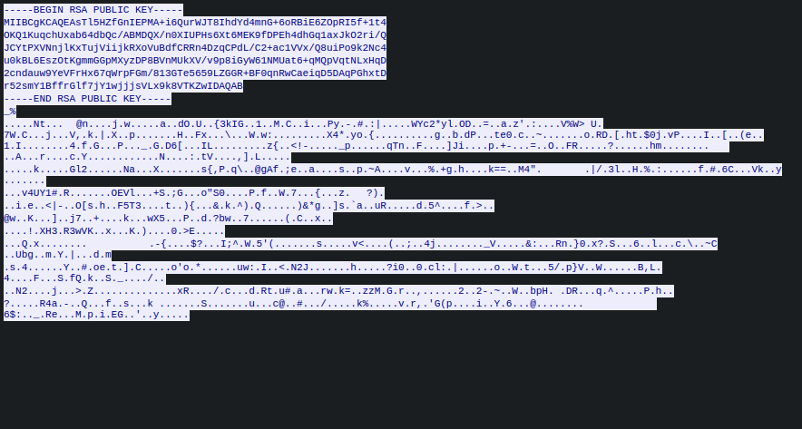

# Mini-Chat-Server

A simple real-time chat server and client that provides RSA encryption (Use at your own risk! I'm not liable for potential data leaks!).

## Usage

Compile the program using the Makefile. Just type `make`. Then you can start the program with

`./minichatserver [-s] [-b <RSA KEY BIT LENGTH>] -u <USERNAME> -a <SERVER-ADRESS> -p <SERVER-PORT>`

Parameters:

- `-u`: Set the username that is shown in the chat to your chat-partner.
- `-a`: If you are the server, then you have to specify your IP-Adress with this parameter. If you are the client, you specify the IP of your chat-partner with this parameter.
- `-p`: If you are the server, then you have to specify the server-port with this parameter. If you are the client, you specify the server's port on your chat-partner's computer with this parameter.

Optional parameters:

- `-s`: Activates the server mode. If you are the server, set this parameter, otherwise don't set it.
- `-b`: Sets the RSA key bit length, default is 2048. You can choose 1024, 2048, 4096 or 8192. A higher number means more security, but your computer needs more time for encryption, decryption and key generation. 1024 is very fast but not recommended for security reasons!

## How it works

When you start this application, a RSA key pair is generated on your computer. If someone connects to your computer (or you connect to another computer), your public keys are automatically exchanged. Then you're asked for verifying the other person's username. After that, you can chat with your contact. The chat can be left by typing `quit_chat`. The other person has to press the `[ENTER]`-key after that (I'm searching for a more intuitive way for quitting the chat).

All traffic except for key exchange (because only public keys are exchanged, this is not associated with any security risk) is fully encrypted. You can use the software Wireshark (https://www.wireshark.org/) to sniff all the traffic:

No encryption is 100 percent safe! As I said before: If you use my software, you use it at your own risk! I'm not liable for potential data leaks!
